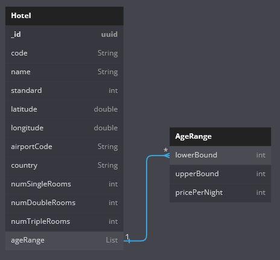
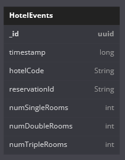
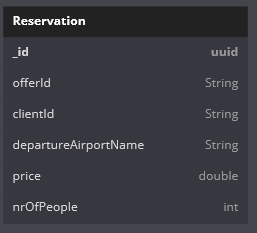
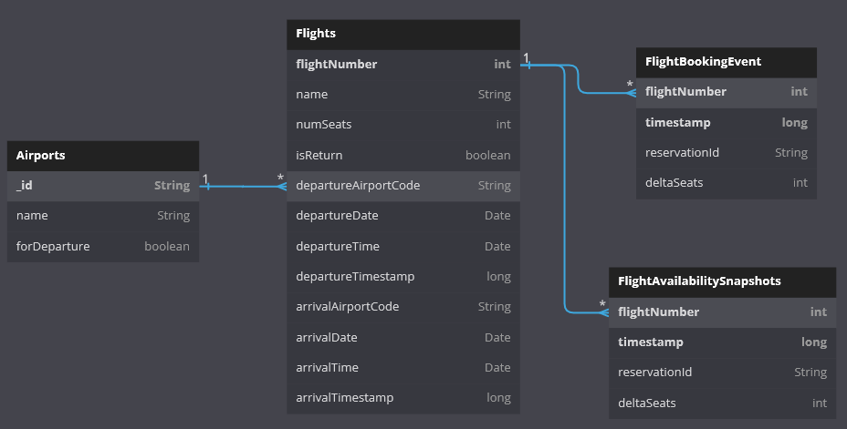
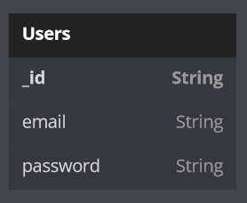
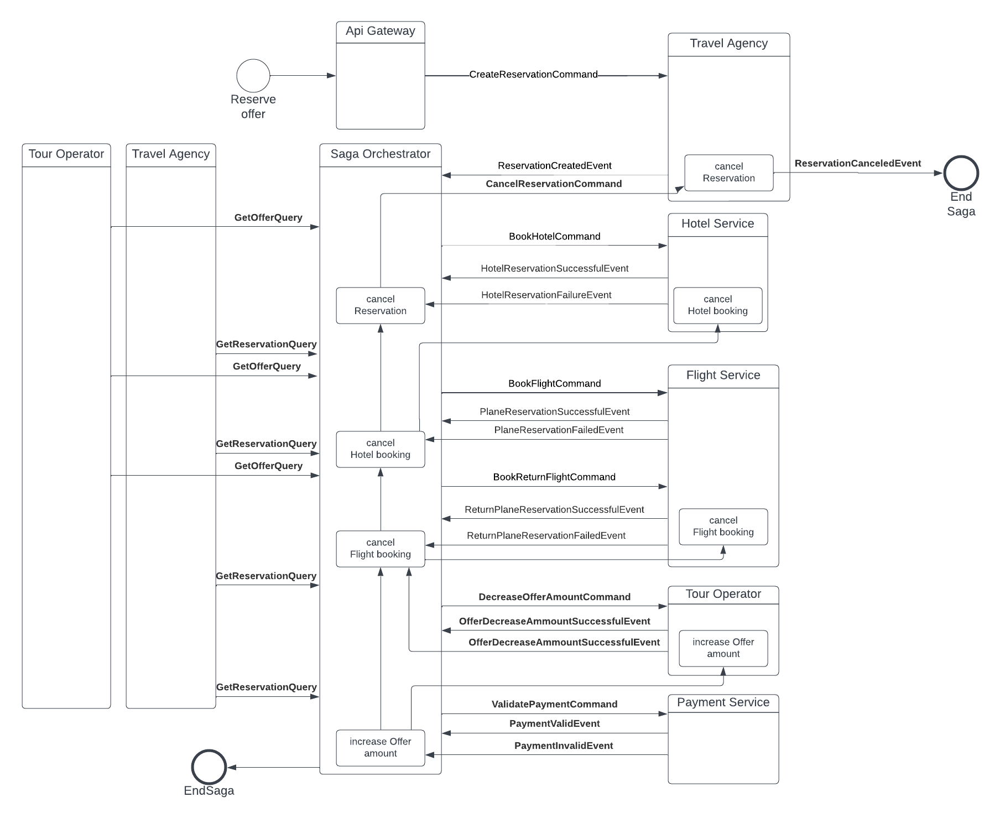

# RSWW Project Architecture

- [RSWW Project Architecture](#rsww-project-architecture)
- [1. Service list](#1-service-list)
- [2. Service responsibility overview](#2-service-responsibility-overview)
  - [2.1. Frontend](#21-frontend)
  - [2.2. API Gateway](#22-api-gateway)
  - [2.3. Travel Agency](#23-travel-agency)
  - [2.4. Tour Operator (commands)](#24-tour-operator-commands)
  - [2.5. Tour Operator (queries)](#25-tour-operator-queries)
  - [2.6. Hotel](#26-hotel)
  - [2.7. Flight](#27-flight)
  - [2.8. Saga Orchestrator](#28-saga-orchestrator)
  - [2.9. Payment](#29-payment)
- [3. Database schemas](#3-database-schemas)
- [4. Saga descriptions](#4-saga-descriptions)
  - [4.1. Booking an offer](#41-booking-an-offer)
- [5. REST API overview](#5-rest-api-overview)
- [6. Messages overview](#6-messages-overview)
  - [6.1. Events](#61-events)
  - [6.2. Commands](#62-commands)
  - [6.3. Queries](#63-queries)

# 1. Service list
 - Frontend 
 - API Gateway
 - Travel Agency
 - Tour Operator command
 - Tour Operator query
 - Hotel
 - Flight
 - Saga Orchestrator
 - Payment Service

# 2. Service responsibility overview

## 2.1. Frontend
- database: none
- Is a component that directly participates in communication and displaying information to the client
- webpage component is created using Angular  
- runs on the user's browser and communicates with the API gateway

## 2.2. API Gateway
  - database: PostgreSQL
  - authorization
  - stores information about its clients and authenticates them
  - takes REST calls from frontend & passes it on to the message broker
  - subscribes to certain Agency messages to create HTTP responses for clients
  - websocket endpoints for offer status updates

## 2.3. Travel Agency
  - database: MongoDB
  - stores all created reservations and creates events that start saga
  - it is an event-sourced service that listens for commands and events that revolve around creating, cancelling and getting reservations

## 2.4. Tour Operator (commands)
  - database: MongoDB
  - event-sourced entity: Offer
  - generates offers (one-time call)
  - listens to World events & Travel Agency booking requests (through Saga) to update offer status
  - provides snapshots for query server

## 2.5. Tour Operator (queries)
  - database: MongoDB
  - stores relatively recent information about offers
  - is able to quickly provide a filtered list of offers as well as information about specific one

## 2.6. Hotel
  - database: MongoDB
  - listens to (& may generate) room booking events
  - maintains information about available hotel rooms
  - notifies any external services about changed availability status
    - e.g. "hotel LCA20064 will have no vacancy from 18.06 until 21.06" is
      an event that Tour Operator may subscribe to, which may invalidate an offer

## 2.7. Flight
  - database: PostgreSQL
  - listens to (& may generate) flight seat booking events
  - maintains information about available plane seats
  - notifies any external services about changed availability status

## 2.8. Saga Orchestrator
  - orchestrates Sagas. more in [4. Saga descriptions](#4-saga-descriptions)

## 2.9. Payment
  - Payment simulation. In response to a Pay command, sends back either:
    - Payment confirmation
    - Payment failure


# 3. Database schemas
<!-- https://dbdiagram.io/d/6485e884722eb77494c3f54a -->
## 3.1. Offerts DB (Mongo)


## 3.2. Hotels DB (Mongo)





## 3.3. Reservations DB (Mongo)



## 3.4. Flights DB (PostgreSQL)



## 3.5. Users DB (PostgreSQL)



# 4. Saga descriptions

<!-- https://lucid.app/lucidchart/c85fc5b5-cf70-4a1d-85e8-97416b94aa47/edit?viewport_loc=-676%2C1335%2C3012%2C1428%2C0_0&invitationId=inv_872fe337-aeca-4ed5-910f-f20a061be61c -->

## 4.1. Booking an offer



# 5. REST API overview

HTTP communication only happens between the frontend and the API Gateway.
All other services communicate using the message broker.

## Endpoints

### POST `/api/admin/generate-offers`
Request body:
```json
{
  "amount": 20
}
```

### Get `/api/hotel/{id}`
request body: empty
response body:
```json
{
  "code": "HER41014",
  "name": "Pela Maria Hotel",
  "standard": 3.0,
  "latitude": 35.312658,
  "longitude": 25.397243,
  "airportCode": "HER",
  "country": "Grecja",
  "numSingleRooms": 12,
  "numDoubleRooms": 35,
  "numTripleRooms": 15,
  "ageRange0": {
    "lowerBound": 0,
    "upperBound": 4,
    "pricePerNight": 81.0
  },
  "ageRange1": {
    "lowerBound": 4,
    "upperBound": 18,
    "pricePerNight": 348.0
  },
  "ageRange2": {
    "lowerBound": 18,
    "upperBound": 200,
    "pricePerNight": 255.0
  }
}
```

### Get `/api/hotel/{id}/availability?startDate=&endDate=`
request body: empty
response body:
{
"numSingleRooms": 12,
"numDoubleRooms": 35,
"numTripleRooms": 15,
"valid": true,
"nonZero": true
}

### Post `/api/offer`
request body:
```json
{
    "hotelBrief": {
        "id": "HER41014",
        "name": "Pela Maria Hotel",
        "standard": 5.0,
        "country": "G"
    },
    "suggestedPrice": 110.0,
    "numberOfOffers": 10,
    "startDate": "2023-06-03T08:00:00",
    "endDate": "2023-06-07T12:00:00",
    "flights": [
        {
            "outboundFlight": {
                "id": "flight789",
                "departureAirportName": "John F. Kennedy International Airport"
            },
            "returnFlight": {
                "id": "flight790",
                "departureAirportName": "John F. Kennedy International Airport"
            }
        }
    ]
}
```
response body: String

### Post `/api/offer/{id}/decrease`
request body:
```json
{
    "numberOfOffers": 1
}
```
response body: String

### Put `/api/offer`
request body:
```json
{
    "id": "9d99ad66-6753-47d1-a8b7-7eda4d3f0f15",
    "suggestedPrice": 1500.00,
    "numberOfOffers": 13,
    "flights": [
        {
            "outboundFlight": {
                "id": "17486",
                "departureAirportName": "KTW"
            },
            "returnFlight": {
                "id": "20294",
                "departureAirportName": "BUD"
            }
        }
    ]
}
```
response body: String

### Get `/api/offer/offers?destination=&departure=&startDate=&people=&page=&pageSize=`
request body: empty
response body: 
```json
[
    {
        "id": "9d99ad66-6753-47d1-a8b7-7eda4d3f0f15",
        "hotelBrief": {
            "id": "BUD21047",
            "name": "Roombach Hotel Budapest Center",
            "standard": 3.0,
            "country": "Węgry"
        },
        "suggestedPrice": 1500.0,
        "numberOfOffers": 3,
        "startDate": "2023-07-19T16:00:00",
        "endDate": "2023-07-24T16:00:00",
        "flights": [
            {
                "outboundFlight": {
                    "id": "17486",
                    "departureAirportName": "KTW"
                },
                "returnFlight": {
                    "id": "20294",
                    "departureAirportName": "BUD"
                }
            }
        ]
    }
]
```

### Get `/api/offer/{id}/`
request body: empty
response body:
```json
{
    "id": "9d99ad66-6753-47d1-a8b7-7eda4d3f0f15",
    "hotelBrief": {
        "id": "BUD21047",
        "name": "Roombach Hotel Budapest Center",
        "standard": 3.0,
        "country": "Węgry"
    },
    "suggestedPrice": 1500.0,
    "numberOfOffers": 3,
    "startDate": "2023-07-19T16:00:00",
    "endDate": "2023-07-24T16:00:00",
    "flights": [
        {
            "outboundFlight": {
                "id": "17486",
                "departureAirportName": "KTW"
            },
            "returnFlight": {
                "id": "20294",
                "departureAirportName": "BUD"
            }
        }
    ]
}
```

### Get `/api/offer/{id}/`
request body: empty
response body:
```json
[
    {
        "id": "844a3167-d805-4c78-bb49-7255612394f5",
        "oldValues": {
            "offerId": "9d99ad66-6753-47d1-a8b7-7eda4d3f0f15",
            "price": 1000.0,
            "numberOfOffers": 13,
            "flights": [
                {
                    "outboundFlight": {
                        "id": "17486",
                        "departureAirportName": "WAW"
                    },
                    "returnFlight": {
                        "id": "20294",
                        "departureAirportName": "BUD"
                    }
                }
            ]
        },
        "newValues": {
            "offerId": "9d99ad66-6753-47d1-a8b7-7eda4d3f0f15",
            "price": 1500.0,
            "numberOfOffers": 1,
            "flights": [
                {
                    "outboundFlight": {
                        "id": "17486",
                        "departureAirportName": "KTW"
                    },
                    "returnFlight": {
                        "id": "20294",
                        "departureAirportName": "BUD"
                    }
                }
            ]
        },
        "timeOfUpdate": "2023-06-12T16:53:30.291"
    }
]
```

### Post `/api/order`
request body:
```json
{
    "offerId": "b0f46008-b438-4631-8e8f-45863c9ecfb1",
    "clientId": "testId",
    "price": "1600",
    "departureAirportName": "WAW",
    "nrOfPeople": 1,
    "numSingleRooms": 1,
    "numDoubleRooms": 0,
    "numTripleRooms": 0,
    "orderStatus": "CREATED"
}
```
request response:
```json
{
    "result": "Order created",
    "orderId": "f24f5e51-db47-4d77-bd83-5d4f55826e40"
}
```

### Post `/api/user/create`
request body:
```json
{
  "email": "123",
  "password": "123"
}
```
request response: String

### Get `/api/user/get-user/{email}`
request body: empty
request response:
```json
{
  "id": "123",
  "email": "123",
  "password": "123"
}
```

# 6. Messages overview

## 6.1. Events

| Name                               | Sender          | Receiver                     | Description                                               |
|------------------------------------|-----------------|------------------------------|-----------------------------------------------------------|
| HotelReservationFailedEvent        | Hotel Service   | Saga Service                 | Information about failed hotel reservation                |
| HotelReservationSuccessfulEvent    | Hotel Service   | Saga Service                 | Information about succesful hotel reservation             |
| OfferCreatedEvent                  | Tour Operator   | Tour Operator                | Has information about newly created offer                 |
| OfferDecreaseAmountEvent           | Tour Operator   | Tour Operator, Saga          | Demand to lower ammount of Offers                         |
| OfferDecreaseAmountFailedEvent     | Tour Operator   | Saga                         | Information about failed lowering of ammount of Offers    |
| OfferDecreaseAmountSuccessfulEvent | Tour Operator   | Saga                         | Information about succesful lowering of ammount of Offers |
| OfferIncreaseAmountEvent           | Tour Operator   | Tour Operator, Saga          | Demand to increase ammount of Offers                      |
| PaymentInvalidEvent                | Payment Service | Saga                         | Information about failed payment validation               |
| PaymentValidEvent                  | Payment Service | Saga                         | Information about succesful payment validation            |
| PlaneReservationFailedEvent        | Flight Service  | Saga                         | Information about failed flight reservation               |
| PlaneReservationSuccessfulEvent    | Flight Service  | Saga                         | Information about succesful return flight reservation     |
| ReturnPlaneReservationFailedEvent  | Flight Service  | Saga                         | Information about failed flight reservation               |
| ReturnPlaneReservationFailedEvent  | Flight Service  | Saga                         | Information about failed return flight reservation        |
| ReservationCanceledEvent           | Travel Agency   | Travel Agency, Saga          | Demand to cancel reservation                              |
| ReservationCreatedEvent            | Travel Agency   | Travel Agency, Saga          | Demand to create reservation                              |
| UpdateOfferEvent                   | Travel Agency   | Travel Agency,  Gateway API  | Demand to update offer                                    | 

## 6.2. Commands

| Name                       | Sender               | Receiver        | Description                                     |
|----------------------------|----------------------|-----------------|-------------------------------------------------|
| BookFlightCommand          | Flight Service, Saga | Flight Service  | Demand to book flight                           |
| BookReturnFlightCommand    | Saga                 | Flight Service  | Demand to book return flight                    |
| CancelFlightBookingCommand | Saga                 | Flight Service  | Demand to cancel flight booking for reservation |
| BookHotelCommand           | Saga                 | Hotel Service   | Demand to book hotel                            |
| CancelHotelBookingCommand  | Saga                 | Hotel Service   | Demand to cancel hotel booking                  |
| CancelReservationCommand   | Saga                 | Travel Agency   | Demand to cancel reservation                    |
| CreateReservationCommand   | Gateway API          | Travel Agency   | Demand to create reservation                    |
| CreateOfferCommand         | Gateway API          | Tour Operator   | Demand to create new offer                      |
| DecreaseOfferAmountCommand | Gateway API, Saga    | Tour Operator   | Demand to lower ammount of Offers               |
| IncreaseOfferAmountCommand | Saga                 | Tour Operator   | Demand to increase ammount of Offers            |
| ValidatePaymentCommand     | Saga                 | Payment Service | Demand to validate payment for offer            |
| AdminGenerateOffersCommand | Gateway              | Tour Operator   | Demand to generate offers                       |
| UpdateOfferCommand         | Gateway              | Tour Operator   | Demand to update offers                         |

## 6.3. Queries

| Name                          | Sender                        | Receiver       | Description                                                     |
|-------------------------------|-------------------------------|----------------|-----------------------------------------------------------------|
| CheckFlightAvailabilityQuery  | Flight Service, Tour Operator | Flight Service | Information about number of seats aviable for flight            |
| FindAllViableFlightPairsQuery | Tour Operator                 | Flight Service | Information about aviable flight pairs for dates and airport    |
| FindBestFlightPairQuery       | Flight Service                | Flight Service | Information about best flight pairs for dates and airport       |
| GetFlightBookingPriceQuery    | Tour Operator                 | Flight Service | Information about price of booking this flight                  |
| GetFlightInfoQuery            | Gateway API                   | Flight Service | Information about flight                                        |
| CheckHotelAvailabilityQuery   | Hotel Service, Tour Operator  | Hotel Service  | Information about number of hotel rooms aviable inbetween dates |
| GetHotelBookingPriceQuery     | Tour Operator                 | Hotel Service  | Information about price of booking the hotel                    |
| GetHotelInfoQuery             | Gateway API                   | Hotel Service  | Information about hotel                                         |
| GetOfferQuery                 | Gateway API, Saga             | Tour Operator  | Information about offer                                         |
| GetOffersQuery                | Gateway Api                   | Tour Operator  | Information about list of filtered offers                       |
| GetRandomHotelQuery           | Tour Operator                 | Hotel Service  | Information about random hotel                                  |
| GetReservationQuery           | Gateway API, Saga             | Travel Agency  | Information about reservation                                   |
| GetOfferHistoriesQuery        | Gateway Api                   | Tour Operator  | Information about history of changes on offers                  |