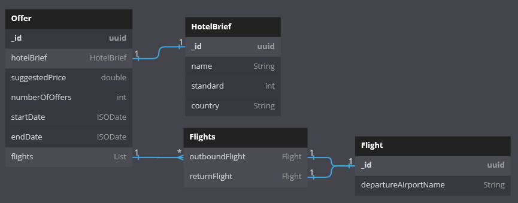
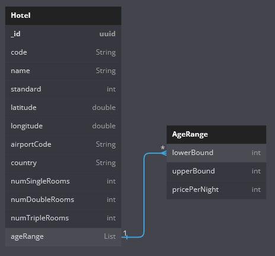
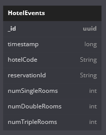
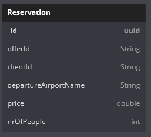
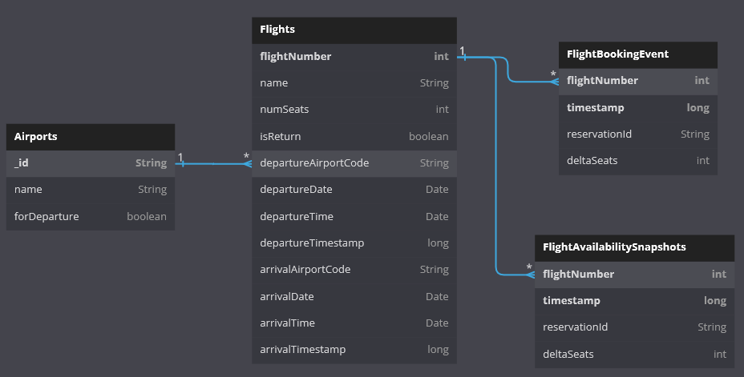
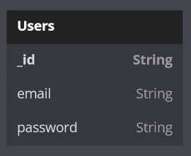

# RSWW Project Architecture

- [RSWW Project Architecture](#rsww-project-architecture)
- [1. Service list](#1-service-list)
- [2. Service responsibility overview](#2-service-responsibility-overview)
  - [2.1. Frontend](#21-frontend)
  - [2.2. API Gateway](#21-api-gateway)
  - [2.3. Travel Agency](#22-travel-agency)
  - [2.4. Tour Operator (commands)](#23-tour-operator-commands)
  - [2.5. Tour Operator (queries)](#24-tour-operator-queries)
  - [2.6. Hotel](#25-hotel)
  - [2.7. Flight](#26-flight)
  - [2.8. Saga Orchestrator](#27-saga-orchestrator)
  - [2.9. Payment](#28-payment)
- [3. Database schemas](#3-database-schemas)
- [4. Saga descriptions](#3-saga-descriptions)
  - [4.1. Booking an offer](#31-booking-an-offer)
- [5. REST API overview](#4-rest-api-overview)
  - [Endpoints](#endpoints)
    - [POST `/api/offers/list`](#post-apiofferslist)
    - [POST `/api/offers/{id}/book`](#post-apioffersidbook)
    - [POST `/api/offer-purchases/{id}/pay`](#post-apioffer-purchasesidpay)
- [6. Messages overview](#5-messages-overview)
  - [6.1. Events](#51-events)

# 1. Service list
 - Frontend 
 - API Gateway
 - Travel Agency
 - Tour Operator command
 - Tour Operator query
 - Hotel
 - Flight
 - Saga Orchestrator
 - Payment Service

# 2. Service responsibility overview

TODO not sure if user service & agency should be merged into one

## 2.1. Frontend
- database: none
- Is a component that directly participates in communication and displaying information to the client
- webpage component is created using Angular  
- runs on the user's browser and communicates with the API gateway

## 2.2. API Gateway
  - database: PostgreSQL
  - authorization
  - stores information about its clients and authenticates them
  - takes REST calls from frontend & passes it on to the message broker
  - subscribes to certain Agency messages to create HTTP responses for clients
  - websocket endpoints for offer status updates

## 2.3. Travel Agency
  - database: MongoDB
  - stores all created reservations and creates events that start saga
  - it is an event-sourced service that listens for commands and events that revolve around creating, cancelling and getting reservations

## 2.4. Tour Operator (commands)
  - database: MongoDB
  - event-sourced entity: Offer
  - generates offers (one-time call)
  - listens to World events & Travel Agency booking requests (through Saga) to update offer status
  - provides snapshots for query server

## 2.5. Tour Operator (queries)
  - database: MongoDB
  - stores relatively recent information about offers
  - is able to quickly provide a filtered list of offers as well as information about specific one

## 2.6. Hotel
  - database: MongoDB
  - listens to (& may generate) room booking events
  - maintains information about available hotel rooms
  - notifies any external services about changed availability status
    - e.g. "hotel LCA20064 will have no vacancy from 18.06 until 21.06" is
      an event that Tour Operator may subscribe to, which may invalidate an offer

## 2.7. Flight
  - database: PostgreSQL
  - listens to (& may generate) flight seat booking events
  - maintains information about available plane seats
  - notifies any external services about changed availability status

## 2.8. Saga Orchestrator
  - orchestrates Sagas. more in [3. Saga descriptions](#3-saga-descriptions-1)

## 2.9. Payment
  - Payment simulation. In response to a Pay command, sends back either:
    - Payment confirmation
    - Payment failure


# 3. Database schemas
<!-- https://dbdiagram.io/d/6485e884722eb77494c3f54a -->
## 3.1. Offerts DB (Mongo)



## 3.2. Hotels DB (Mongo)





## 3.3. Reservations DB (Mongo)



## 3.4. Flights DB (PostgreSQL)



## 3.5. Users DB (PostgreSQL)



# 4. Saga descriptions

## 4.1. Booking an offer
  1. [Agency] Create `OfferBooking` and init status to "waiting" (rollback: don't delete, set status to "error")
  2. [Flight] Try to book airplane seats
  3. [Hotel] Try to book hotel rooms
  4. [Tour Operator] Acknowledge offer sale
  5. [Agency] Update status to "booked" and wait 1 minute for payment confirmation
  6. [Agency] Update status to "done"

no more sagas are necessary imo

# 5. REST API overview

HTTP communication only happens between the frontend and the User service.
All other services communicate using the message broker.

## Endpoints

### POST `/api/offers/list`
Request body:
```json
{
  "filters": {
    "maxPrice": 3300,
    "countries": ["Grecja", "Bułgaria"],
    "page": 1,
    "offersPerPage": 20
  }
}
```

Response body:
```javascript
{
  "offers": [
    {
      "hotelCode": "DS3",
      "hotelStandard": 1437.0,
      /* ... */
    }
    /* etc... */
  ]
}
```

### POST `/api/offers/{id}/book`
request body: empty  
response body: 
```json
{
  "offerPurchaseId": "87cfh8q7nhr78a3bvcn90r3y"
}
```
status: 200 (booked), 404 (no such offer) or 400 (offer unavailable)

### POST `/api/offer-purchases/{id}/pay`
request body: empty  
response body: empty  
status: 200 (payment confirmed), 404 (no such offer purchase)

# 6. Messages overview

## 6.1. Events
